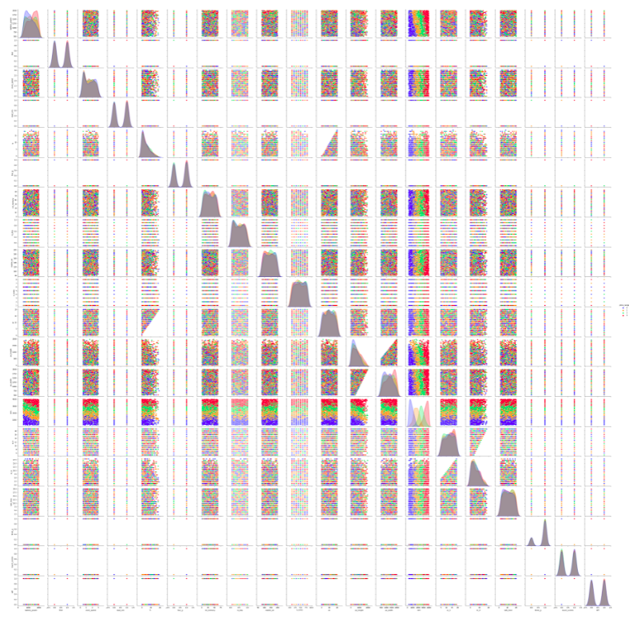
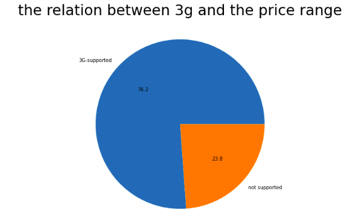
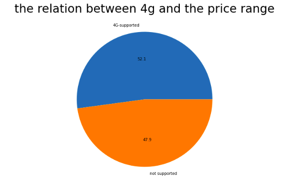
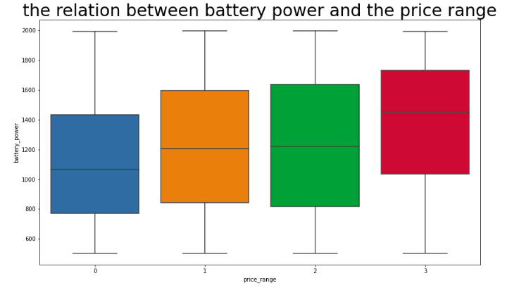
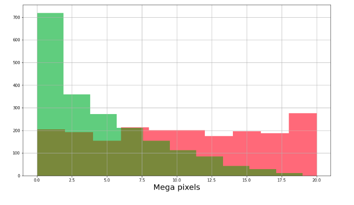
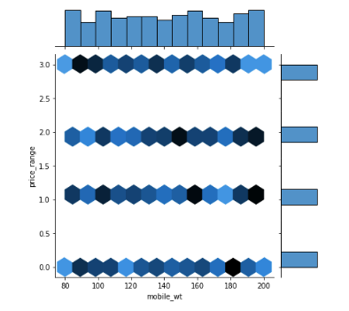
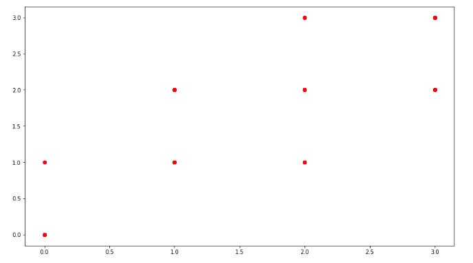
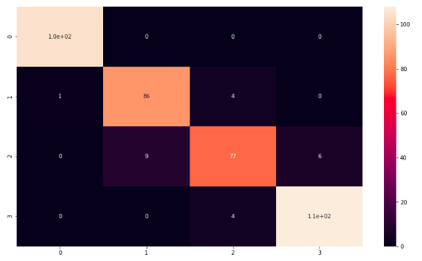

# Mobile price prediction

# AIM
In this Project,We're going to predict the price range of each mobile in the dataset based on the mobile specifications as : Battery power, 3G enabled , wifi ,Bluetooth, Ram etc .

# Usage
- This kind of prediction will help companies to  estimate the price of mobiles of an mobile phone based on its specifications.
- Beside that it will help Consumers to verify that they are paying best price according to the specs of the mobile.

# Contents
1. **About the data.**

2. **Importing the libraries and the data.**

3. **Understanding the data.**

4. **Data analysis and visualization.**

    

    1. How does ram is affected by price ?

    

    2. What is the relation between Internal Memory and Price Range ? 

    

    3. What is the percentage of Phones which support 3G ?

    
    

    4. What is the percentage of Phones which support 4G ?

    
    
    
    5. What is the relation between Battery power and Price Range ?

    

    6. Visualizing No of Phones vs Camera megapixels of front and primary camera.

    
    
    
    7. What is the relation between Mobile Weight and Price Range ?

        
    

    8. What is the relation between Talk time and Price Range ?

    
    
    

5. **Preprocessing the data.**

    1. Normalizing the continuous columns.

    2. Splitting the data.

6. **developing the machine learning models.**

    1. Linear regression.
    
    2. Logistic regression.

    3. Decision tree.

    4. SVM.

    5. K-Nearest neighbors.

    6. Random forest.

7. **Conclusion.**

8. **Prediction on the test set.**

# Conclusion

logistic regression model outperforms other models in the mobile price classification problem with accuracy 94% .

